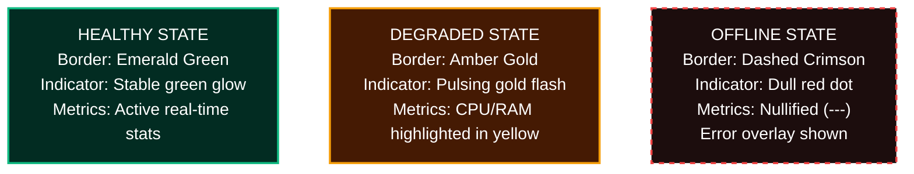

# Cairn Metrics Dashboard Visual Design System

This document outlines the visual identity, style guidelines, and layout rationale for the **Cairn Phase 3 Metrics Dashboard**. It establishes a cohesive design language tailored for developer observability, prioritizing quick visual scanning, cognitive offloading, and premium developer-focused aesthetics.

---

## 1. Design Philosophy & Theme

Observability tools demand high information density, clear categorization, and minimal visual fatigue. To achieve this, the Cairn dashboard is built on a **Deep Obsidian Dark Mode** aesthetic. Dark mode minimizes eye strain during prolonged monitoring sessions and allows high-contrast semantic colors to pop immediately, directing the operator's eye to anomalies.

*   **Aesthetic Style:** Glassmorphism, flat-panels with subtle borders, clean geometric lines, and low-glow indicators.
*   **Theme Foundation:** Deep Obsidian Slate.

---

## 2. Color Palette

The color scheme is divided into **base canvas layers** (neutral backgrounds and borders) and **semantic category tokens** (accents that correspond strictly to specific metric classifications). 

### 2.1 Base Canvas Layers

| Layer | Hex Code | HSL Value | Description |
| :--- | :--- | :--- | :--- |
| **Canvas Background** | `#0B0F19` | `HSL(224, 38%, 7%)` | The deep obsidian background of the entire viewport. |
| **Card / Panel Surface** | `#111827` | `HSL(220, 24%, 12%)` | Surface background for cards, charts, and table elements. |
| **Border / Divider** | `#1F2937` | `HSL(220, 13%, 18%)` | Subtle borders separating cards to create grid definition without clutter. |
| **Subtle Hover** | `#1F293D` | `HSL(220, 32%, 18%)` | Active highlight state when hovering over a card or list item. |

### 2.2 Semantic Category Tokens

To avoid random colors, each category of telemetry maps to a single, dedicated hue. This enables developers to scan the dashboard and immediately identify what type of metric they are looking at:

#### A. Hit/Miss Category (Throughput & Efficiency)
*   **Cache Hits:** `#10B981` (Emerald Green | `HSL(160, 84%, 39%)`)
    *   *Rationale:* Green represents healthy, successful executions that bypass the slower database layer.
*   **Cache Misses:** `#F43F5E` (Coral Crimson | `HSL(348, 89%, 60%)`)
    *   *Rationale:* Warm red/pink signals that requests missed the cache, triggering fallback database latency.

#### B. Eviction Category (Cache Lifecycles & Constraints)
*   **Active Capacity Evictions:** `#F97316` (Blaze Orange | `HSL(25, 95%, 53%)`)
    *   *Rationale:* Orange indicates capacity limits are breached. High capacity eviction counts signal that the cache size (`cairn.cache.max-size`) might be undersized.
*   **TTL Natural Expirations:** `#64748B` (Muted Slate | `HSL(215, 16%, 47%)`)
    *   *Rationale:* Stale key expiration is a natural, expected behavior. Muted slate keeps it visible but visually subservient to active evictions.

#### C. Latency Category (Performance Metrics)
*   **GET Latency:** `#6366F1` (Electric Indigo | `HSL(239, 84%, 67%)`)
    *   *Rationale:* Fast read latency profile.
*   **SET Latency:** `#8B5CF6` (Bright Violet | `HSL(258, 90%, 66%)`)
    *   *Rationale:* Heavy write latency profile.
*   **DELETE Latency:** `#14B8A6` (Cool Teal | `HSL(173, 80%, 40%)`)
    *   *Rationale:* Clean-up operations profile.

---

## 3. Typography Hierarchy

The font family selection uses a geometric sans-serif for display elements, a high-legibility sans-serif for interface text, and a tabular monospace font for raw telemetry numbers.

| Font Family | Usage | Rationale |
| :--- | :--- | :--- |
| **Space Grotesk** / **Outfit** | Dashboard Header, Section Titles, Large Metric values | Geometric structure that gives a clean, tech-forward, premium feel. |
| **Inter** | Labels, Description, UI Controls, Logs | One of the most legible UI typefaces available, minimizing reading fatigue. |
| **Fira Code** / **JetBrains Mono** | IPs, Ports, Keys, Latency numbers, Log traces | Tabular monospaced numerals ensure that numbers line up vertically, allowing developers to compare values instantly without scanning jitter. |

### Font Hierarchy Configuration

```
┌────────────────────────────────────────────────────────┐
│ DASHBOARD TITLE (Space Grotesk - 24px, Bold, #F9FAFB)  │
└────────────────────────────────────────────────────────┘
  ┌────────────────────────────────────────────────────┐
  │ Section Title (Space Grotesk - 16px, Semi-Bold)   │
  └────────────────────────────────────────────────────┘
    ┌────────────────────────────────────────────────┐
    │ Metric Value (Fira Code - 20px, Medium)        │
    │ Label Text (Inter - 12px, Regular, #9CA3AF)     │
    └────────────────────────────────────────────────┘
```

---

## 4. Layout Rationale & User Hierarchy

The layout arrangement is designed from top to bottom based on the severity of operational impact:

1.  **Top Row: Cluster Health & Node Cards**
    *   *Priority:* Critical.
    *   *Why:* If a physical JVM node is offline or experiencing severe hardware stress (high CPU/RAM), the cluster topology is compromised. Operators must see this first before looking at logical cache statistics.
2.  **Middle Left: Aggregated Hit/Miss Gauge**
    *   *Priority:* High.
    *   *Why:* This is the primary key performance indicator (KPI) of the cache's efficiency. A rapid drop in hit rate indicates configuration issues or bad eviction policies.
3.  **Middle Right: Latency Percentile Chart (p50, p95, p99)**
    *   *Priority:* High.
    *   *Why:* Directly relates to application SLAs. Even if the hit rate is high, high lock-contention latency could impact client performance. Placed alongside the hit/miss gauge to give a quick overview of throughput vs speed.
4.  **Lower Row: Eviction & Expiry Counters**
    *   *Priority:* Medium.
    *   *Why:* These are diagnostic metrics. If hit rates are low or latency is high, developers look here next to see if keys are expiring naturally or being forcefully expelled due to capacity limits.
5.  **Bottom Row: Real-time System Logs & Metrics Stream**
    *   *Priority:* Low (Active scanning) / High (Deep debugging).
    *   *Why:* Real-time textual logs are too dense for quick visual scanning but indispensable for verifying event sequences (e.g. confirming a specific sweep task executed). Placing them at the bottom keeps them accessible without cluttering high-level charts.

---

## 5. Component States

A key addition to this design document is defining the visual transition states for interactive components, specifically the cluster node cards.

### 5.1 Node Card State Matrix



#### Detailed State Specifications:

1.  **HEALTHY (Active)**
    *   *Visuals:* Solid border (`#1F2937`). Accent left-border (`#10B981`, 4px). Small status dot in top-right glows steady green.
    *   *Interactive Behavior:* Hovering scales the card slightly (`transform: scale(1.01)`) and brightens the border to `#10B981`.
    *   *Metrics:* Key occupancy and CPU/RAM display normal system values.
2.  **DEGRADED (Warning)**
    *   *Triggers:* CPU > 85%, memory usage > 90%, or p99 read latency > 10ms.
    *   *Visuals:* Solid border (`#F59E0B`). Accent left-border (`#F59E0B`, 4px). Status dot pulses slowly (2-second fade interval) in amber.
    *   *Alerting:* A small warning banner appears next to the node hostname: `⚠️ HIGH CPU LOAD`.
    *   *Metrics:* The specific offending metric turns `#F59E0B`.
3.  **OFFLINE (Unreachable)**
    *   *Triggers:* Node fails to respond to Actuator health checks for > 15 seconds.
    *   *Visuals:* Dashed border (`#EF4444`). Background card drops to 40% opacity. Accent left-border (`#EF4444`, 4px). Status dot is static dim red.
    *   *Alerting:* A prominent crimson error overlay is displayed across the card: `❌ UNREACHABLE (HTTP 503 / Connection Refused)`.
    *   *Metrics:* All telemetry fields (CPU, memory, keys) are cleared and replaced with a dash (`—`).
